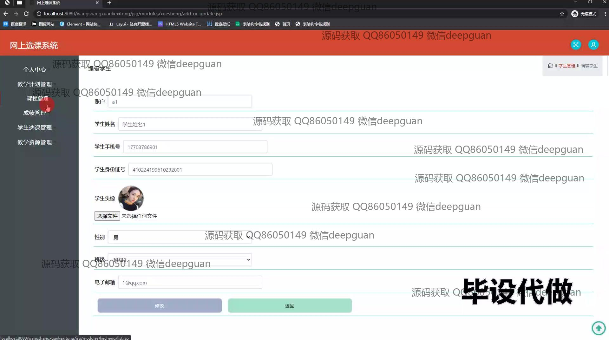
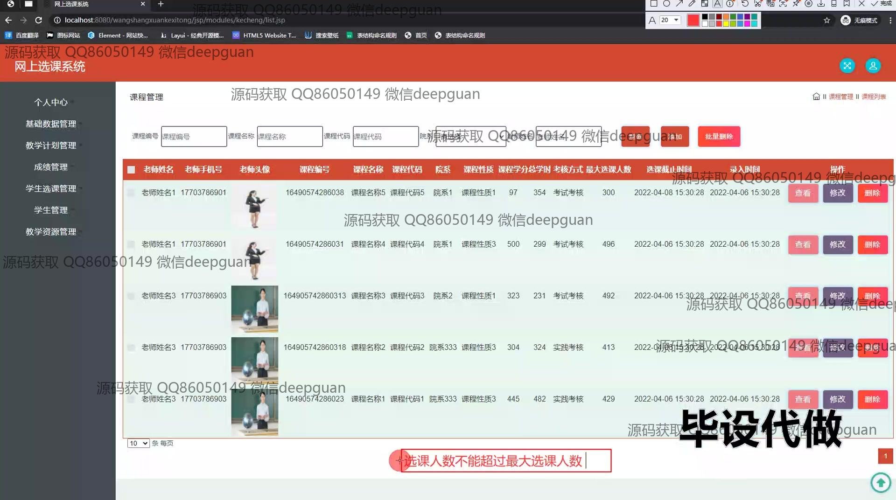
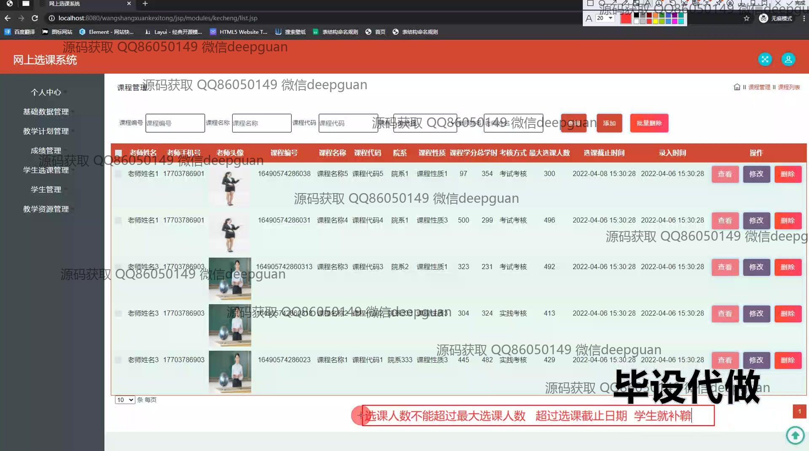

<h1 align="center">基于SpringMVC网上选课系统的设计与实现+jsp</h1>

## 简介
基于SpringMVC的网上选课系统：角色分为管理员、教师、学生；功能包括课程管理、学生管理、教学计划管理、成绩管理和选课管理，多模块支持用户便捷交互与管理操作。    --计算机毕业设计源码；毕设源码；java毕业设计源码

## 联系方式

<h3 align="center">获取完整代码与数据库文件 + 微信：deepguan QQ: 86050149 QQ群: 783742310</h3>

<h3 align="center">可帮忙远程部署 包运行成功！提供远程部署、修改代码、设计文档指导、代码讲解等服务！</h3>

## 功能介绍（完整见运行截图）
管理员：基本功能包括登录、课程管理、教室管理、院系管理、学生信息管理和教师信息管理，通过导航栏的功能模块，可进行添加、修改、删除和批量删除等操作。系统提供教学计划管理、成绩统计与管理及教学资源管理功能，通过图表展示成绩分布并支持查询不同课程数据。可以管理基础数据，通过多条件搜索功能筛选并操作课程、学生及教师信息。

教师：可通过个人中心登录修改个人信息及查看教学计划，主要负责课程信息的编辑、查看选课学生名单及上传成绩详情。系统支持通过文件上传成绩详情及结果导出，老师可以利用搜索功能快速定位需要的课程或班级并进行相关操作。可利用教学资源管理模块提交或管理教学资料。

学生：访问系统需注册并登录，在个人中心查看或修改基本信息，包括课程选课、编辑个人信息及可选择注册选课。通过系统提供的选课管理模块，学生可查看已选课程及进行退选操作。学生亦可通过成绩管理模块查看个人成绩分布情况，利用图表工具便捷取得各课程的考核成绩状态和分布信息。

普通用户：基本操作为登录及使用公共教学资源，系统展示后台为管理员及教师提供维护支持，普通用户可访问公开的课程信息及教学计划概览。用户可查看公共的成绩分析图标信息，利用系统提供的公共搜索工具筛选可公开查看的课程或教师信息。

## 运行截图

本代码来源于网络,仅供学习参考使用!

